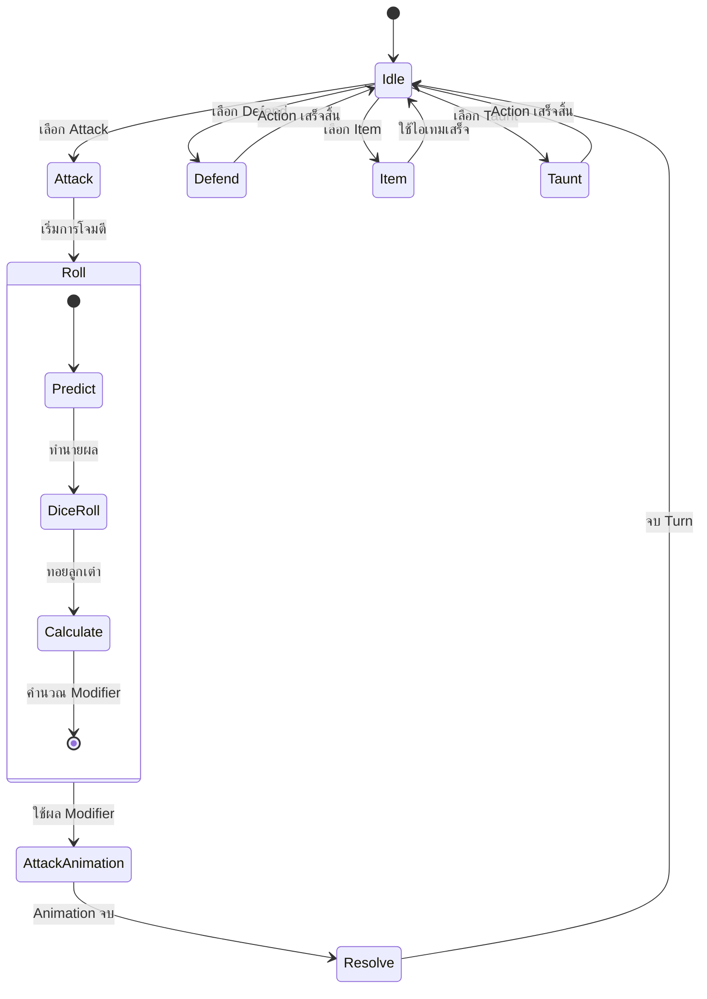

# Mechanic Design — [Player Actions]

## State Diagram

## Rules

| State            | เข้าเงื่อนไข                  | ออกเงื่อนไข         | Note                                                                                                                     |
| ---------------- | ----------------------------------------- | ------------------------------ | ------------------------------------------------------------------------------------------------------------------------ |
| Idle             | เริ่มเกม / เริ่มเทิร์น | เลือก Action              | รอผู้เล่นเลือกคำสั่ง                                                                                 |
| Attack           | ผู้เล่นเลือก Attack           | เริ่ม Roll                | เตรียมการโจมตี                                                                                             |
| Roll             | เริ่มการโจมตี                | คำนวณ Modifier เสร็จ | ผู้เล่นทำนายผลก่อน ระบบทอยลูกเต๋า และสร้าง Modifier สำหรับการโจมตี |
| Attack Animation | ได้ผลจาก Roll แล้ว            | Animation จบ                 | เล่น Animation การโจมตีตามค่า Modifier                                                                 |
| Resolve          | Animation จบ                            | กลับ Idle                  | คำนวณ Damage และใช้ผลของ Modifier                                                                        |
| Defend           | ผู้เล่นเลือก Defend           | Action เสร็จ              | -                                                                                                                        |
| Item             | ผู้เล่นเลือก Item             | ใช้ไอเทมเสร็จ     | -                                                                                                                        |
| Taunt            | ผู้เล่นเลือก Taunt            | Action เสร็จ              | -                                                                                                                        |
