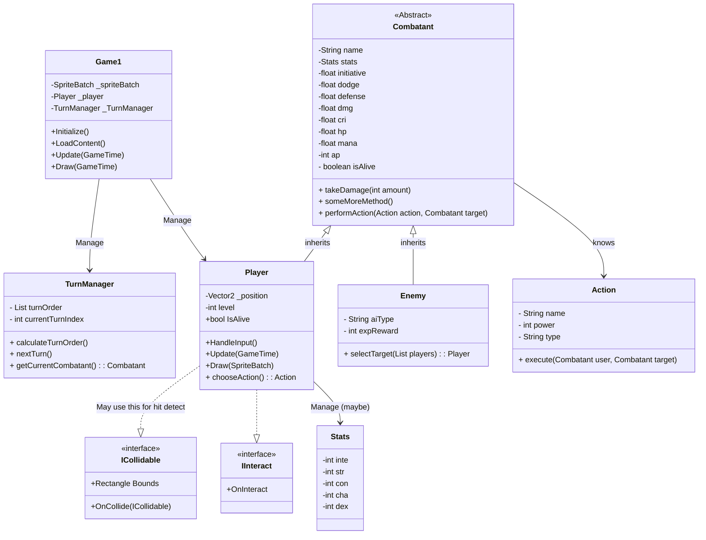

# Class Diagram — [Jo's Game]

```mermaid
classDiagram
    class Game1 {
        -SpriteBatch _spriteBatch
        -Player _player
	-TurnManager _TurnManager 
        +Initialize()
        +LoadContent()
        +Update(GameTime)
        +Draw(GameTime)
    }
    class Stats{
        -int inte
	-int str
	-int con
	-int cha
	-int dex
    }
    class TurnManager {
        - List<Combatant> turnOrder
        - int currentTurnIndex
        + calculateTurnOrder()
        + nextTurn()
        + getCurrentCombatant() : Combatant
    }
    class Combatant {
        <<Abstract>>
        -String name
        -Stats stats
	-float initiative
        -float dodge
	-float defense
	-float dmg
	-float cri
	-float hp
	-float mana
	-int ap
        - boolean isAlive
        + takeDamage(int amount)
        + someMoreMethod ()
        + performAction(Action action, Combatant target)
    }
    class Player {
        -Vector2 _position
	-int level
        +bool IsAlive
        +HandleInput()
        +Update(GameTime)
        +Draw(SpriteBatch)
	+ chooseAction() : Action
    }
    class Enemy {
        - String aiType
        - int expReward
        + selectTarget(List<Player> players) : Player
    }
    class Action {
        - String name
        - int power
        - String type
        + execute(Combatant user, Combatant target)
    }
    class ICollidable {
        <<interface>>
        +Rectangle Bounds
        +OnCollide(ICollidable)
    }
    class IInteract {
        <<interface>>
        +OnInteract
    }
    Game1 --> Player : Manage
    Game1 --> TurnManager : Manage
    Player ..|> ICollidable : May use this for hit detect
    Player ..|> IInteract 
    Player --> Stats : Manage (maybe)
    Combatant <|-- Player : inherits
    Combatant <|-- Enemy : inherits
    Combatant --> Action : knows
```
