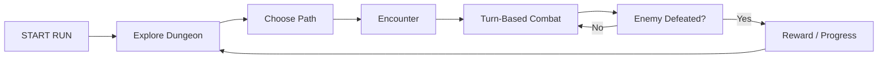

# [Jo's Game] — Core Loop & Gameplay ?

## Core Loop

## Core Mechanics

1. [Roguelike Progression]
2. [Vessel & Weapon Synergy]
3. [Turn-Based Combat]
4. [3×3 Grid Combat]
5. [Split-Screen Co-op]

## Controls

| Key               | Action               |
| ----------------- | -------------------- |
| W, A, S, D        | Movement, Microgames |
| Space             | Microgames           |
| Left Mouse Button | Microgames           |
| E                 | Interact             |

## Win / Lose Condition

- **ชนะเมื่อ:** เอาชนะศัตรูและผ่าน Dungeon / ทำ Run สำเร็จ
- **แพ้เมื่อ:** Vessel HP หมด หรือผู้เล่นทั้งสองไม่สามารถต่อสู้ต่อได้
