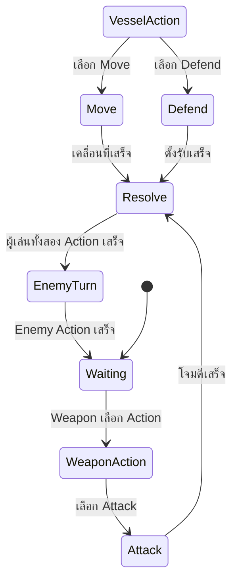

# Mechanic Design — [Player Actions]

## State Diagram

## Rules

| State            | เข้าเงื่อนไข                  | ออกเงื่อนไข         | Note                                                                                                                     |
| ---------------- | ----------------------------------------- | ------------------------------ | ------------------------------------------------------------------------------------------------------------------------ |
| Waiting             | เริ่มเทิร์น | ผู้เล่นเลือก Action              | รอผู้เล่นเลือกคำสั่ง                                                                                 |
| Vessel Action           | Vessel เลือก Action           | เลือก Move / Defend                | Vessel เป็นผู้ควบคุมตำแหน่งและการป้องกัน                                                                                             |
| Weapon Action             | Weapon เลือก Action                | เลือก Attack | Weapon เป็นผู้ควบคุมการโจมตี |
| Move | Vessel เลือก Move            | เคลื่อนที่เสร็จ                 | Vessel และ Weapon ย้ายไปยังช่องที่เลือกด้วยกัน                                                                 |
| Defend          | Vessel เลือก Defend                            | Action เสร็จ                  | คำนวณ Damage และใช้ผลของ Modifier                                                                        |
| Attack           | Weapon เลือก Attack           | โจมตีเสร็จ              | Weapon โจมตี Enemy จากตำแหน่งปัจจุบัน                                                                                                                        |
| Resolve             | Action ของผู้เล่นเสร็จ             | ทั้งสอง Action เสร็จ     | ตรวจสอบผลของ Move, Defend และ Attack                                                                                                                        |
| Enemy Turn            | ผู้เล่นทั้งสอง Action เสร็จ            | Enemy Action เสร็จ              | Enemy ทำการโจมตีหรือเปลี่ยนสถานะ                                                                                                                        |
