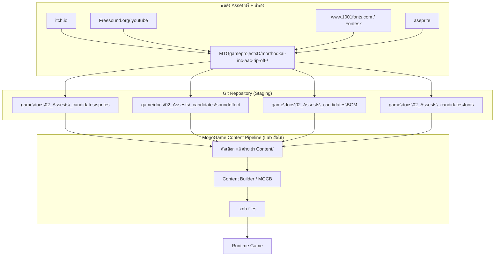

## Asset Pipeline Flow

```mermaid
flowchart TD
    subgraph SOURCES["แหล่ง Asset ฟรี + ทำเอง"]
        K1[itch.io] --> C1[MTGgameprojectxD/morthodkai-inc-aac-rip-off-/]
        K2[Freesound.org/ youtube] --> C1
        K3[www.1001fonts.com / Fontesk] --> C1
	K4[aseprite] --> C1
    end

    subgraph REPO["Git Repository (Staging)"]
        C1 --> R1[game\docs\02_Assests\_candidates\sprites]
        C1 --> R2[game\docs\02_Assests\_candidates\soundeffect]
        C1 --> R3[game\docs\02_Assests\_candidates\BGM]
        C1 --> R4[game\docs\02_Assests\_candidates\fonts]
    end

    subgraph PIPELINE["MonoGame Content Pipeline (Lab ถัดไป)"]
        R1 --> CP[คัดเลือก แล้วย้ายเข้า Content/]
        R2 --> CP
        R3 --> CP
        R4 --> CP
        CP --> P1[Content Builder / MGCB]
        P1 --> XNB[.xnb files]
    end

    XNB --> GAME[Runtime Game]
```
