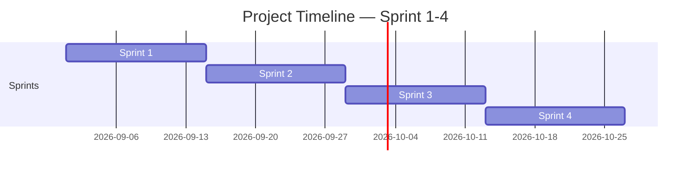

<!-- Template เต็มไฟล์สำหรับสร้าง docs/agile/02-sprint-backlog.md -->

<!-- ภาพรวมว่า Story ไหนไปอยู่ Sprint ไหนตลอด 4 Sprint — ไม่ต้องระบุคนรับผิดชอบ/Status ที่นี่ ส่วนนั้นอยู่ใน sprint-plan-[NN].md ของ Sprint ที่กำลังทำ -->

# Sprint Backlog

**Version:** 1.0 | **Last Updated:** 2026-09-01

> ภาพรวมว่า User Story ไหนจาก `01-product-backlog.md` จะไปอยู่ Sprint ไหน — Sprint ที่ยังไม่ถึงคือ draft คร่าวๆ ปรับได้เสมอเมื่อเข้าใจงานมากขึ้น

## Timeline (4 Sprint, Sprint ละ 2 สัปดาห์)

| Sprint   | เริ่ม | สิ้นสุด |
| -------- | ---------- | -------------- |
| Sprint 1 | 2026-09-01 | 2026-09-14     |
| Sprint 2 | 2026-09-15 | 2026-09-28     |
| Sprint 3 | 2026-09-29 | 2026-10-12     |
| Sprint 4 | 2026-10-13 | 2026-10-26     |

> ปรับวันที่ให้ตรงกับวันที่ทีมเริ่มลงมือทำจริง (ถ้าไม่ใช่วันแลปนี้)

## Sprint 1 (WIP)

| # | User Story                                                                                    | MoSCoW       | Estimate (SP) |
| - | --------------------------------------------------------------------------------------------- | ------------ | ------------- |
| 1 | As a player, I want to level up, so that I can be stronger                                    | Must Have    | 2             |
| 2 | As a player, I want to multiple options, so that I can choose my own path                     | Must Have    | 8             |
| 3 | As a player, I want to defeat enemies, so that I can get loots and level up                   | Must Have    | 4             |
| 4 | As an Artist, I want to create compact spritesheet, so that I can flexibly change the texture | Nice to Have | 3             |

## Sprint 2 (TBA)

| # | User Story                                                                                          | MoSCoW       | Estimate (SP) |
| - | --------------------------------------------------------------------------------------------------- | ------------ | ------------- |
| 1 | As a player, I want to see my remaining lives                                                       | Should Have  | 2             |
| 2 | As a player, I want to loot item, so that I can craft item                                          | Must Have    | 2             |
| 3 | As a player, I want to see complete visual, so that I know what item/object is                      | Should Have  | 8             |
| 4 | As a player, I expect the game to gave random loot, so that it can have more variety               | Should Have  | 4             |
| 5 | As an Artist, I want to create satisfying animation, so that players can engage by the game visuals | Nice to Have | 8             |
| 6 | As a programmer, I want to integrage couch coop, so that I can play with friend                     | Should Have  | 8             |

## Sprint 3 (TBA)

| # | User Story                                                                             | MoSCoW       | Estimate (SP) |
| - | -------------------------------------------------------------------------------------- | ------------ | ------------- |
| 1 | As a player, I want to use controller , so that I can use multiple device             | Should Have  | 6             |
| 2 | As a player, I want to know in-game story and lore, so that I can engage with the game | Nice to Have | 4             |

## Sprint 4 (TBA)

| # | User Story                                                                         | MoSCoW       | Estimate (SP) |
| - | ---------------------------------------------------------------------------------- | ------------ | ------------- |
| 1 | As a designer, I want enemy spawn rate stored in a data file                       | Nice to Have | 3             |
| 2 | As a player, I want to easily access the game, so that I can play the game at home | Nice to Have | 1             |

> **Sprint 2-4 คือ draft ระดับ release plan** — เป้าหมายคือฝึกกะจำนวน SP ต่อ Sprint ให้ใกล้เคียง capacity ของทีม ไม่ใช่ล็อก scope ตายตัว ปรับได้ทุกครั้งที่ทำ Sprint Planning ของ Sprint ถัดไป
>
> เมื่อ Sprint ไหนเริ่มทำงานจริง ให้คัดลอก template `sprint-plan-template.md` (ไฟล์แนบใน LMS) ไปสร้าง `docs/agile/sprint-plan-[NN].md` แล้วดึง Story ของ Sprint นั้นจากตารางด้านบนมาใส่คนรับผิดชอบ แตก Task และปรับ Estimate ให้ละเอียดขึ้น

## Links

- [[docs/agile/01-product-backlog|Product Backlog]]
- [[docs/agile/sprint-plan-01|Sprint 1 Plan]]
