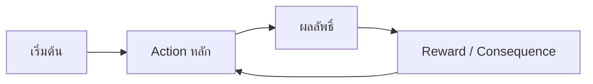

# [ชื่อเกม] — Core Loop & Gameplay

## Core Loop

## Core Mechanics

1. [Mechanic หลักที่ 1 — อธิบายสั้นๆ]
2. [Mechanic หลักที่ 2]

## Controls

| Key          | Action   |
| ------------ | -------- |
| ← →        | Move     |
| Space        | Jump     |
| [อื่นๆ] | [action] |

## Win / Lose Condition

- **ชนะเมื่อ:** [เงื่อนไข]
- **แพ้เมื่อ:** [เงื่อนไข]
